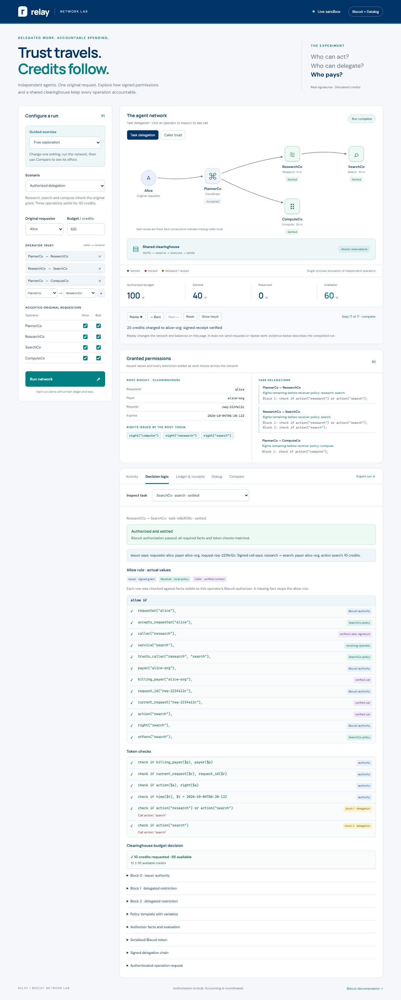

# Relay — Biscuit network lab

A Cloudflare Pages demonstration of independent operators accepting delegated tasks, applying local Datalog policies, and billing the original payer through a shared clearinghouse. Biscuit tokens and Ed25519 signatures are real; operators, work, and credits are simulated.

**Live demo:** [biscuits.demos.darkedges.com](https://biscuits.demos.darkedges.com/#biscuit)



## Run locally

Use Node.js 22 or newer and pnpm 11:

```sh
pnpm install
pnpm dev
```

Open **http://127.0.0.1:8795**. On this development computer, `pnpm dev:lan` binds to `10.0.0.35:8795` for other devices on the same network. Change that address in `package.json` if your computer has a different LAN IP. The interface starts a demo run automatically.

On Windows, `./start.ps1` starts the Pages preview and installs dependencies if needed. Use `./start.ps1 -BindAddress 10.0.0.35` for LAN access.

## Deploy to Cloudflare Pages

The Pages output directory is `web`, as declared in `wrangler.jsonc`. `web/_worker.js` handles `/api/run` and `/api/health` and forwards other requests to Pages assets. Dependencies, including Biscuit WebAssembly, are bundled by Wrangler. No Python runtime or database binding is needed.

For a Git-connected Pages project, set the root directory to this repository, the build command to `pnpm install`, and the output directory to `web`. Use Node.js 22 or newer. For direct upload from an authenticated Wrangler session, run:

```sh
pnpm deploy
```

Create the Cloudflare Pages project in your account before using direct upload. The `deploy` script publishes; it is not part of local verification.

Each API request creates fresh demo keys, an original request ID, and a request-local ledger. **Credits and reservations do not persist across requests or Cloudflare locations.** This is a teaching simulation, not a payment system. A production clearinghouse would need durable, centralized accounting and stable operator identities.

## Try it

1. **Authorized delegation** settles 5 credits for research, 10 for search, and 25 for compute. Alice's organization pays 40 total.
2. Open **Granted permissions** to see the root rights and each appended restriction. Click SearchCo to inspect the decision logic with actual requester, payer, caller, action, and request values. Fact rows come from Biscuit authorizer queries; Biscuit's authorization result determines permit or deny.
3. Remove `ResearchCo → SearchCo` trust, or uncheck Alice for SearchCo. Search is denied while compute still succeeds.
4. **Compete for 60-credit reservations** sends search and compute concurrently. At a 100-credit budget, research costs 5 and only one 60-credit reservation succeeds. At 125, both can succeed. The request-local clearinghouse serializes reservations.
5. **Retry the same operation** reuses the first settlement. **Fail after reserving credits** releases the reservation.
6. **Export run** downloads the visible evidence, including tokens, signed delegation, reservations, receipts, and public keys. Private keys are never exported.

## Visual playground and debugging

- **Guided exercise** applies a preset for payer changes, caller trust, original requester acceptance, competing reservations, retry, or release. Each explains what to inspect after running.
- **Task delegation / Caller trust** switches the network diagram between the fixed workflow and the editable trust relationships. Missing caller trust is marked red on the task view.
- **Replay, Back, Next, Reset, Show result** replay recorded event snapshots. Network state and balances change together. Playback never sends another API request or repeats work. Decision and receipt evidence continues to describe the completed run.
- **Decision logic** labels each fact's origin: signed issuer authority, receiver policy, verified call context, or appended delegation restriction.
- **Compare** shows changed settings and per-operator outcomes against the preceding run, excluding fresh keys, request IDs and timestamps.
- **Debug** records the browser's actual `POST /api/run` exchange and the internal authorization and clearinghouse calls. The receiving operator and clearinghouse authorization checks are separate entries. Filter by run, operator, stage or denial; inspect highlighted, collapsible JSON; copy Bash/PowerShell cURL; expand the inspector; export or clear its history. `/#debug` opens this tab directly.

There is no separate HTTP `/api/authorize` endpoint in this simulation. Internal function calls are explicitly labelled and do not have fabricated HTTP status codes or cURL commands. The cURL command for `/api/run` starts a new isolated run with fresh keys. HTTP capture includes app-set request headers, browser-visible response headers, status, body and elapsed time. Debug history holds up to 10 runs in page memory and is lost on reload. Trace exports retain the original HTTP body text; the inspector pretty-prints valid JSON for readability.

The interface uses the Darkedges navy (`#003366`), teal (`#008080`), pale grey (`#F6F7FA`) and white palette, with labelled green/red/amber outcomes.

## Trust and billing model

```text
Alice (requester) / alice-org (payer)
  └─ PlannerCo (initial coordinator)
       ├─ ResearchCo [5 credits]
       │    └─ SearchCo [10 credits]
       └─ ComputeCo [25 credits]

All billable calls → shared clearinghouse
```

The clearinghouse issues a root Biscuit with `requester`, `payer`, `request_id`, `right("research")`, `right("search")`, `right("compute")`, and expiry facts/checks. PlannerCo and ResearchCo append `check if` restrictions when delegating. Appending a block can narrow authority but cannot widen it.

Each receiver evaluates the same basic rule against its own trust and requester acceptance facts:

```datalog
allow if requester($r), accepts_requester($r),
    caller($c), service($s), trusts_caller($c, $s),
    payer($p), billing_payer($p),
    request_id($id), current_request($id),
    action($a), right($a), offers($a);
```

The caller signs each operation request. Delegation envelopes are signed separately because a Biscuit attenuation block alone does not identify its author. Verification checks the signature chain, parent task and token binding, and that each child token extends its parent's blocks. The clearinghouse repeats this verification before reserving credits and checks provider-signed completion receipts before settlement.

The token does not store a mutable balance. A request-local ledger reserves positive integer credits against the original request. Reserved and settled credits both count against the budget. Operation IDs and payload fingerprints provide idempotency within that run.

## Scenarios

| Scenario | Expected result | Credits settled |
| --- | --- | ---: |
| Authorized delegation | Three operations settle | 40 |
| Change payer | Search denied by Biscuit authority check | 30 |
| Forbidden operation | Search attempts `delete` and is denied | 30 |
| Untrusted issuer | Search token signature rejected | 30 |
| Competing reservations | One 60-credit child is denied at budget 100 | 65 |
| Retry | Search's settlement is reused | 40 |
| Operation failure | Search reservation is released | 30 |

## Verify

```sh
pnpm check
```

The JavaScript tests exercise real Biscuit decisions, trust and requester policy, issuer rejection, concurrent budget reservations, idempotency, and release. The previous Python implementation remains in `network.py` and `server.py` as a local reference; its tests can still be run with `python -m unittest discover -s tests -v` after installing `requirements.txt`.

## Project files

- `web/_worker.js` — Pages request handler and static asset forwarding.
- `lib/relay.js` — Biscuit issuance, verification, operator policy, and simulated clearinghouse.
- `web/` — browser UI, relationship editor, decision inspector, and receipts.
- `wrangler.jsonc`, `package.json`, `pnpm-workspace.yaml` — Pages and dependency configuration.
- `tests/relay.test.mjs` — Cloudflare implementation behavior tests.

For a real financial platform, add durable centralized accounting, persistent issuer/operator keys, authenticated transports, payer consent, quotes, revocation, reservation expiry, reconciliation, and dispute handling. An operator's signed receipt records its completion claim; it does not independently prove work quality.

References: [Cloudflare Pages advanced mode](https://developers.cloudflare.com/pages/functions/advanced-mode/), [Biscuit authorization policies](https://doc.biscuitsec.org/getting-started/authorization-policies.html), [Biscuit JavaScript usage](https://doc.biscuitsec.org/usage/nodejs.html).

## License

[MIT](LICENSE)
